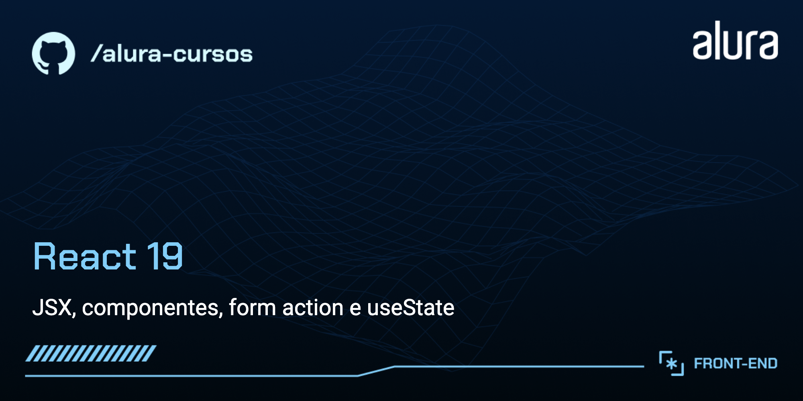
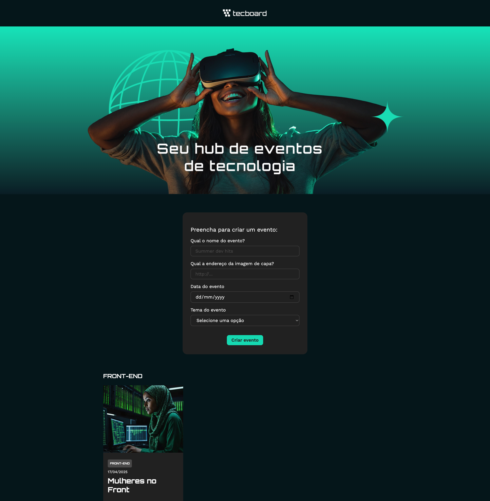

# Tecboard

Seu hub de eventos de tecnologia! Este projeto foi construído com React e tem como objetivo facilitar a criação e visualização de eventos voltados para temas como Front-end, Back-end, Cloud e muito mais.

## 🔨 Funcionalidades do projeto

- Criação de eventos personalizados com imagem, título, data e tema.
- Organização dos eventos por tema.
- Persistência dos dados em memória (estado local do React).



## ✔️ Técnicas e tecnologias utilizadas

- **React + Vite**: Estrutura leve para desenvolvimento com React.
- **useState**: Para gerenciamento do estado local dos eventos.
- **Componentização**: Separação clara de responsabilidades por componente.
- **Formulários com `FormData`**: Captura de dados estruturada.
- **CSS Modules**: Estilos organizados por componente com escopo local.
- **Google Fonts (Work Sans + Orbitron)**: Tipografia personalizada.

## 🛠️ Como rodar o projeto

1. Clone o repositório:

```bash
git clone https://github.com/seu-usuario/tecboard.git
cd tecboard
```

2. Instale as dependências:

```bash
npm install
```

3. Rode o projeto localmente:

```bash
npm run dev
```

4. Acesse no navegador:

```
http://localhost:5173
```

**Imagens disponíveis:**

- `imagem_1.png` até `imagem_15.png`
- `imagem_extra_1.png` até `imagem_extra_15.png`

**Formato de uso direto no projeto:**

```txt
https://raw.githubusercontent.com/viniciosneves/tecboard-assets/refs/heads/main/imagem_1.png
https://raw.githubusercontent.com/viniciosneves/tecboard-assets/refs/heads/main/imagem_extra_9.png
```

## 📚 Sobre o projeto

Esse projeto foi desenvolvido com fins educacionais para praticar:

- Componentização no React.
- JSX.
- Manipulação de formulários e dados.
- Estilização com CSS.
- Uso de props e renderização condicional.

Ideal para quem quer dar os primeiros passos em React criando algo visual, interativo e útil.

Se quiser adicionar deploy com Vercel, persistência com LocalStorage ou backend com Firebase, este projeto é uma ótima base para evoluir!

Vida longa e próspera 🖖

